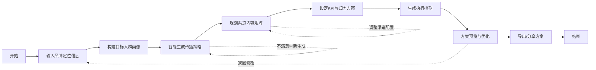

# 营销策划辅助系统 - 产品需求文档 (PRD)

## 1. 产品概述

营销策划辅助系统是一款面向品牌营销人员、广告策划师和市场运营人员的智能策略生成工具。系统基于品牌定位和目标人群特征，自动设计整合传播策略，规划多渠道内容矩阵，定制内容形式与传播节奏，设定可衡量的KPI并建议归因方式，帮助营销团队快速产出高质量、可落地、可追踪、可优化的营销方案。

### 核心价值
- **提效降本**：将传统数天的策略策划周期缩短至分钟级
- **创意赋能**：基于专业营销框架生成有记忆点、有传播力的创意方案
- **数据驱动**：提供可量化的KPI体系和科学的归因模型
- **全渠道覆盖**：整合社交媒体、KOL、线下活动、PR等多元传播渠道

## 2. 核心功能

### 2.1 用户角色

| 角色 | 描述 | 核心权限 |
|------|------|----------|
| 营销策划师 | 品牌方市场部人员、广告公司策划人员 | 使用全部策略生成功能，导出方案 |
| 品牌管理者 | 品牌负责人、市场总监 | 查看方案、审批策略、对比多版本方案 |

### 2.2 功能模块

1. **品牌定位输入**：品牌基本信息、核心价值、品牌调性、竞品分析
2. **目标人群画像**：人口统计学特征、行为特征、兴趣偏好、消费能力、触媒习惯
3. **传播策略生成**：整合传播策略、核心创意概念、传播主题、关键信息
4. **渠道内容矩阵**：社交媒体、KOL营销、线下活动、PR公关四大渠道规划
5. **内容形式定制**：各渠道适配的内容类型、内容样例、发布节奏
6. **KPI与归因**：量化指标设定、归因模型建议、监测方案
7. **执行方案**：时间排期、资源预算、风险预案、优化建议
8. **方案管理**：方案保存、版本对比、导出分享

### 2.3 页面详情

| 页面名称 | 模块名称 | 功能描述 |
|----------|----------|----------|
| 首页/工作台 | 方案列表、快速创建、数据概览 | 展示用户历史方案，一键创建新方案，核心数据指标概览 |
| 品牌信息页 | 品牌基础信息、品牌调性、核心价值、竞品信息 | 表单化输入品牌定位相关信息，支持保存为品牌档案 |
| 人群画像页 | 基本属性、行为特征、兴趣偏好、触媒习惯 | 可视化人群画像构建，支持标签化选择和自定义描述 |
| 策略生成页 | 核心创意、传播主题、策略框架 | 智能生成整合传播策略，支持多版本生成和择优 |
| 渠道矩阵页 | 社交媒体、KOL营销、线下活动、PR公关 | 四象限渠道规划，每个渠道独立配置内容和节奏 |
| KPI设置页 | 指标设定、归因模型、监测方案 | 可量化KPI体系，多种归因模型选择 |
| 执行排期页 | 时间线、资源分配、风险预案 | 甘特图式排期，资源预算分配，风险识别与应对 |
| 方案详情页 | 完整方案展示、导出、分享 | 整合所有模块的完整方案，支持PDF导出和链接分享 |

## 3. 核心流程

### 3.1 主流程描述
用户从首页点击"新建方案"开始，依次填写品牌信息、构建目标人群画像，系统基于输入智能生成传播策略，用户可调整优化各渠道内容矩阵和KPI设定，最后生成完整的执行方案并导出。

### 3.2 核心流程图

## 4. 用户界面设计

### 4.1 设计风格

**设计理念：专业、智慧、富有创造力**

- **主色调**：深邃靛蓝 (#1E3A5F) - 代表专业与信赖
- **辅助色**：活力橙 (#FF6B35) - 代表创意与能量
- **点缀色**：薄荷绿 (#2EC4B6) - 代表数据与增长
- **背景色**：雾灰 (#F5F7FA) - 干净清爽的工作环境
- **字体**：标题使用 "Noto Serif SC" 展现专业质感，正文使用 "Noto Sans SC" 保证可读性
- **按钮风格**：微圆角 (8px)，微妙阴影，悬停时有柔和的上浮动效
- **布局风格**：卡片式布局，清晰的信息层级，充足的留白
- **图标风格**：线性图标，统一笔触，与品牌色调一致
- **动效**：柔和的过渡动画，页面切换时的渐入效果，数据加载时的骨架屏

### 4.2 页面设计概述

| 页面名称 | 模块名称 | UI元素 |
|----------|----------|--------|
| 首页/工作台 | 方案卡片网格、快速创建按钮、数据统计卡片 | 渐变背景Hero区、卡片悬浮动效、数字滚动动画 |
| 品牌信息页 | 分步表单、品牌调性选择器、竞品对比表格 | 进度指示器、标签选择器、动态表单验证 |
| 人群画像页 | 画像雷达图、标签云、触媒习惯饼图 | 可视化图表、拖拽标签、实时预览 |
| 策略生成页 | 策略卡片、创意概念展示、多版本切换 | 卡片翻转效果、生成动画、版本Tab切换 |
| 渠道矩阵页 | 四象限渠道布局、渠道详情面板、内容时间线 | 渠道图标动画、折叠面板、横向滚动时间轴 |
| KPI设置页 | 指标卡片、归因模型选择、漏斗图 | 数字输入滑块、模型对比卡片、漏斗可视化 |
| 执行排期页 | 甘特图、资源分配条形图、风险清单 | 时间轴拖拽、进度条、风险等级标签 |
| 方案详情页 | 方案目录、内容分区、操作工具栏 | 锚点导航、打印样式、导出按钮动效 |

### 4.3 响应式设计

- **设计原则**：桌面优先，移动端适配
- **桌面端** (≥1280px)：完整功能，多栏布局，充分利用屏幕空间
- **平板端** (768px-1279px)：两栏布局，侧边栏可折叠
- **移动端** (&lt;768px)：单列布局，底部导航，简化表单，核心功能优先

### 4.4 交互细节

- 所有可点击元素有明确的悬停状态和点击反馈
- 表单输入有实时验证和友好的错误提示
- 数据加载使用骨架屏和进度条，减少等待焦虑
- 策略生成过程有步骤动画，展示AI"思考"过程
- 图表数据变化有平滑过渡动画

