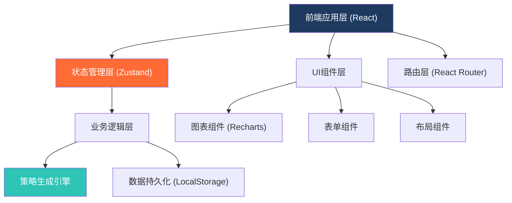
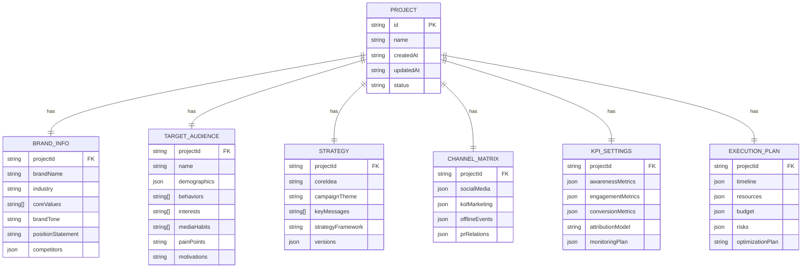

# 营销策划辅助系统 - 技术架构文档

## 1. 架构设计



## 2. 技术描述

### 2.1 技术栈选型

- **前端框架**：React@18 - 组件化开发，生态成熟
- **构建工具**：Vite@5 - 极速开发体验，热更新快
- **样式方案**：TailwindCSS@3 + CSS Variables - 原子化CSS，开发效率高
- **状态管理**：Zustand - 轻量级状态管理，API简洁
- **路由管理**：React Router@6 - 声明式路由，支持嵌套路由
- **图表库**：Recharts - React原生图表库，样式可定制
- **图标库**：Lucide React - 轻量级线性图标库
- **动画库**：Framer Motion - 流畅的React动画库
- **日期处理**：date-fns - 轻量日期工具库

### 2.2 设计决策说明

1. **纯前端架构**：无需后端服务，所有数据存储在 LocalStorage，降低部署和使用成本
2. **策略生成引擎**：内置基于营销专业框架的规则引擎，根据输入参数智能生成策略方案
3. **组件化设计**：高度可复用的UI组件库，保证界面一致性和开发效率
4. **响应式布局**：使用 TailwindCSS 的响应式工具类，适配多端设备

## 3. 路由定义

| 路由路径 | 页面名称 | 说明 |
|----------|----------|------|
| / | 首页/工作台 | 方案列表、快速创建入口、数据概览 |
| /project/new | 新建方案-品牌信息 | 第一步：输入品牌定位信息 |
| /project/:id/audience | 人群画像页 | 第二步：构建目标人群画像 |
| /project/:id/strategy | 策略生成页 | 第三步：查看和优化传播策略 |
| /project/:id/channels | 渠道矩阵页 | 第四步：规划各渠道内容矩阵 |
| /project/:id/kpi | KPI设置页 | 第五步：设定KPI和归因方案 |
| /project/:id/schedule | 执行排期页 | 第六步：生成执行排期和资源分配 |
| /project/:id/preview | 方案详情页 | 完整方案预览、导出、分享 |
| /project/:id | 方案详情（快捷入口） | 重定向到方案预览页 |

## 4. 数据模型

### 4.1 核心数据结构



### 4.2 数据存储

- **存储方式**：浏览器 LocalStorage
- **数据序列化**：JSON 格式
- **数据Key**：`marketing_plans` - 存储所有方案列表
- **单条数据Key**：`plan_{id}` - 存储单个方案完整数据
- **容量管理**：定期清理，提供导出备份功能

## 5. 核心模块设计

### 5.1 策略生成引擎

- **输入**：品牌信息、人群画像
- **输出**：传播策略、核心创意、关键信息
- **算法**：基于营销框架的规则引擎 + 模板匹配 + 随机化创意因子
- **特点**：支持多版本生成，每次生成结果有差异

### 5.2 渠道内容规划器

- **社交媒体**：平台选择、内容类型、发布频率、互动策略
- **KOL营销**：KOL层级、合作形式、内容方向、筛选标准
- **线下活动**：活动类型、规模建议、场地选择、现场互动
- **PR公关**：媒体矩阵、稿件规划、发声节奏、危机预案

### 5.3 KPI与归因模块

- **指标体系**：认知层、兴趣层、行动层、忠诚层四层漏斗
- **归因模型**：首次点击、末次点击、线性、时间衰减、U型模型
- **监测方案**：工具推荐、埋点建议、数据报表频率

### 5.4 执行排期生成器

- **时间规划**：预热期、引爆期、延续期三阶段
- **资源分配**：按渠道分配预算和人力资源
- **风险管理**：识别潜在风险，提供应对预案
- **优化机制**：A/B测试建议、数据复盘周期

## 6. 目录结构

```
src/
├── components/          # 通用UI组件
│   ├── layout/         # 布局组件
│   ├── forms/          # 表单组件
│   ├── charts/         # 图表组件
│   └── ui/             # 基础UI组件
├── pages/              # 页面组件
│   ├── Home/
│   ├── BrandInfo/
│   ├── Audience/
│   ├── Strategy/
│   ├── Channels/
│   ├── KPI/
│   ├── Schedule/
│   └── Preview/
├── store/              # 状态管理
│   ├── useProjectStore.ts
│   └── useUIStore.ts
├── engine/             # 策略生成引擎
│   ├── strategyEngine.ts
│   ├── channelPlanner.ts
│   ├── kpiGenerator.ts
│   └── scheduleBuilder.ts
├── data/               # 静态数据和模板
│   ├── brandTemplates.ts
│   ├── audienceTags.ts
│   ├── channelConfigs.ts
│   └── kpiLibraries.ts
├── types/              # TypeScript类型定义
│   └── index.ts
├── utils/              # 工具函数
│   ├── storage.ts
│   ├── helpers.ts
│   └── constants.ts
├── hooks/              # 自定义Hooks
│   └── index.ts
├── App.tsx
├── main.tsx
└── index.css
```

## 7. 性能与体验优化

### 7.1 性能优化
- 路由懒加载，减少首屏加载时间
- 组件 memo 优化，避免不必要的重渲染
- 大列表虚拟化（如有需要）
- 图标按需加载

### 7.2 用户体验
- 表单自动保存，防止数据丢失
- 操作撤销/重做功能
- 引导式新手教程
- 键盘快捷键支持
- 加载状态和骨架屏

